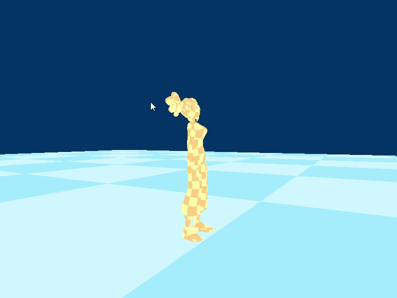

# Character Controller

For this project I aimed at making a basic character controller, featuring standard 3rd person controls + some animations for movement.
The idea was to make a bare minimum of a framework, that could allow me to create a simple 3D game in the future.
I did all this from scratch, using C++ and DirectX12.

Some of the key features of the project are the following:
 - An asset management system, that supports adding content to the project (in terms of geometry, animations and other types of data)
 - An asset editor, which I wrote in JavaScript, using ElectronJS, to help edit assets more easily
 - A garbage collection system, that manages the lifecycle of some particular type of objects at runtime
 - Support for generating some meta data for the C++ classes in the project, that the Asset Editor can use
 - Parser for XML, that I use for loading data from COLLADA (.dae) files

Nothing special is done for graphics, yet. I'm currently using a simple flat rendering model, that doesn't support any lighting.

Anyway, here is a demo of what I have so far:

